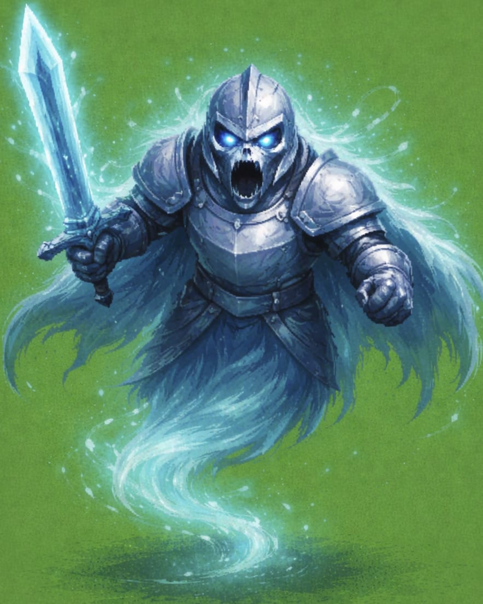

<!DOCTYPE html>
<html lang="en">
<head>
  <meta charset="UTF-8">
  <title>🧠 AI Enemy Dungeon Game</title>
</head>
<body>

<h1 align="center">🧠 AI Enemy Dungeon Game 🎮</h1>

  <b>A 2D dungeon game built from scratch in Python where enemies learn using Reinforcement Learning.</b> 
  <i>Not just a game — an AI experiment you can play.</i>

<h2>🚀 Project Overview</h2>

<strong>AI Enemy Dungeon Game</strong> is a <b>2D top-down dungeon game</b> developed using
<b>Python + Pygame</b>, where enemies are powered by <b>Reinforcement Learning (Q-Learning)</b>.

Unlike traditional games with fixed enemy behavior, enemies in this game
<b>learn from player actions</b>, adapt strategies, and become smarter over time.

🎯 This project is designed for:

<ul>
  <li>🧑‍🎓 Students & beginners in AI</li>
  <li>🎮 Game development learners</li>
  <li>🤖 Understanding Reinforcement Learning visually</li>
  <li>📂 Portfolio & GitHub showcase</li>
</ul>

<h2>🎬 Game Start Screen</h2>

The game begins with a clean and minimal start menu.

  

<ul>
  <li>▶️ Press <b>ENTER</b> to start the game</li>
  <li>🎨 Simple UI for instant understanding</li>
</ul>

<h2>🕹️ Gameplay & HUD</h2>

During gameplay, the player sees a real-time HUD showing:

<ul>
  <li>❤️ Player Health</li>
  <li>⭐ Score</li>
  <li>📈 Level Progression</li>
  <li>🧠 Enemy Learning Status</li>
</ul>

  

<h2>🧍 Player Character</h2>

You control the player using keyboard controls.

  

<ul>
  <li>⌨️ Controls: <b>W A S D</b></li>
  <li>🚶 Smooth movement</li>
  <li>🧱 Boundary-restricted inside the dungeon</li>
</ul>

<h2>👾 AI Enemy (Reinforcement Learning)</h2>

Enemies are not scripted — they <b>learn using Q-Learning</b>.

  

Enemy behavior includes:

<ul>
  <li>🔁 Observing player position</li>
  <li>🎯 Choosing actions (CHASE / RUN / ATTACK)</li>
  <li>📊 Receiving rewards & penalties</li>
  <li>🧠 Improving decisions over time</li>
</ul>

The enemy’s learning is saved and loaded automatically using <code>pickle</code>.

<h2>🗺️ Dungeon Floor & Environment</h2>

The dungeon world is created using a <b>tile-based map system</b>.

  

<ul>
  <li>🟩 Repeating floor tiles</li>
  <li>📐 Grid-based movement</li>
  <li>🎨 Pixel-art style environment</li>
</ul>

<h2>📈 Level Progression</h2>

As the score increases:

<ul>
  <li>⬆️ Level increases</li>
  <li>👾 New enemies spawn</li>
  <li>⚡ Difficulty increases</li>
</ul>

This ensures replayability and challenge.

<h2>🔊 Sound Effects</h2>

<ul>
  <li>💥 Collision sound using <code>pygame.mixer</code></li>
  <li>🎧 Improves game feel and feedback</li>
</ul>

<h2>⌨️ Controls</h2>

<table border="1" cellpadding="6">
<tr><th>Key</th><th>Action</th></tr>
<tr><td>ENTER</td><td>Start Game</td></tr>
<tr><td>W A S D</td><td>Move Player</td></tr>
<tr><td>R</td><td>Restart Game</td></tr>
<tr><td>Close Window</td><td>Exit Game</td></tr>
</table>

<h2>🛠️ Technologies Used</h2>

<ul>
  <li>🐍 Python</li>
  <li>🎮 Pygame</li>
  <li>🧠 Reinforcement Learning (Q-Learning)</li>
  <li>💾 Pickle (AI memory)</li>
</ul>

<h2>🏁 Final Note</h2>

This project demonstrates that:

<ul>
  <li>✅ Games can teach AI concepts</li>
  <li>✅ Reinforcement Learning can be visual</li>
  <li>✅ Python is powerful for game + AI projects</li>
</ul>

  <b>⭐ If you like this project, consider giving it a star!</b>

</body>
</html>
